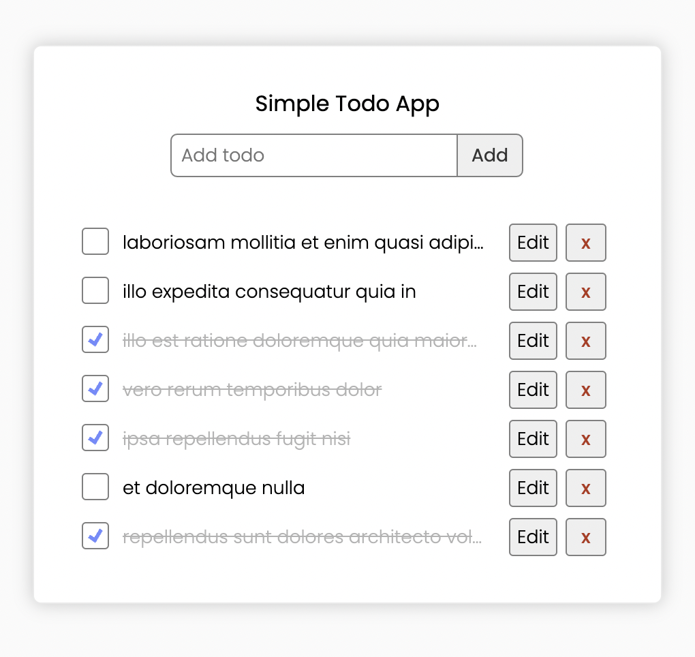

# Webpack5 / React / Redux Toolkit Boilerplate Template


Simple boilerplate to learn actual Webpack5 with React-ReduxToolkit bundle.




## Features

* Latest Webpack 
* Typescript
* Latest Sass compiler
* Linter enabled

## Installation

* Download latest release from [List of Releases](https://github.com/alvytsk/webpack5-react-redux-boilerplate/releases).
* Extract the release archive to a new directory, rename it to your project name and browse the directory.
* Install dependencies

```sh 
$ yarn
```

## Development

You can run example Todo project by typing

```sh 
$ yarn start
```

## Production

```sh 
$ yarn build
```

## Run code style linters

### JavaScript

```sh 
$ yarn lint
$ yarn lint:fix
```